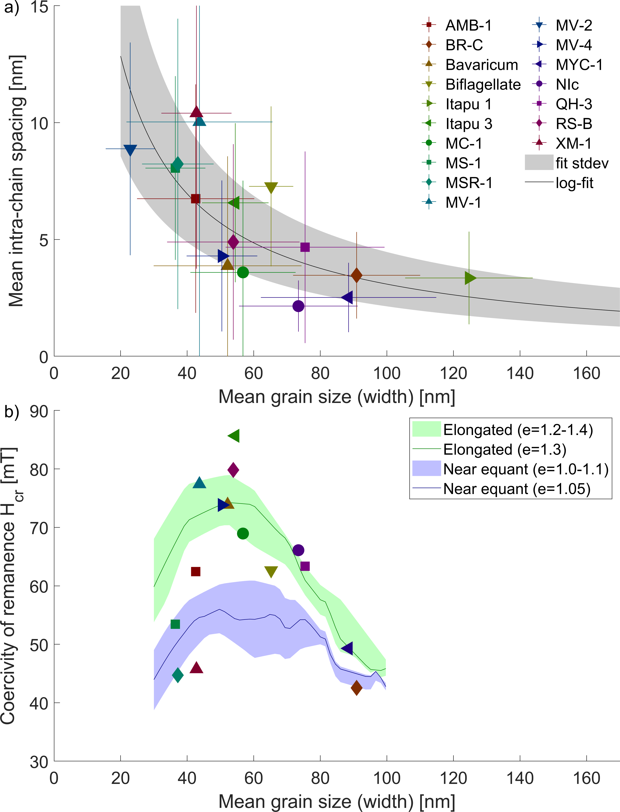
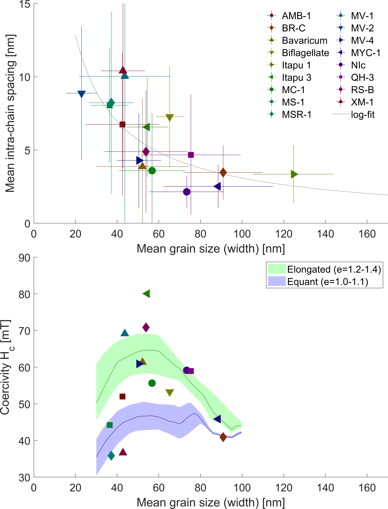
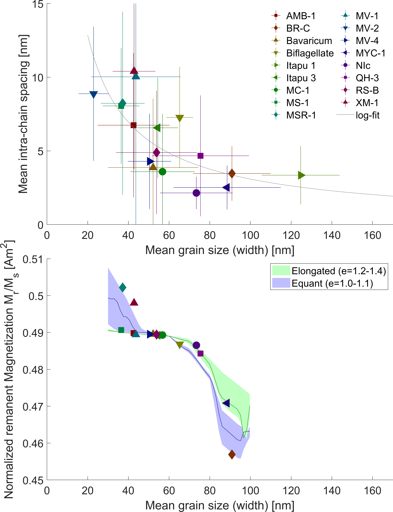
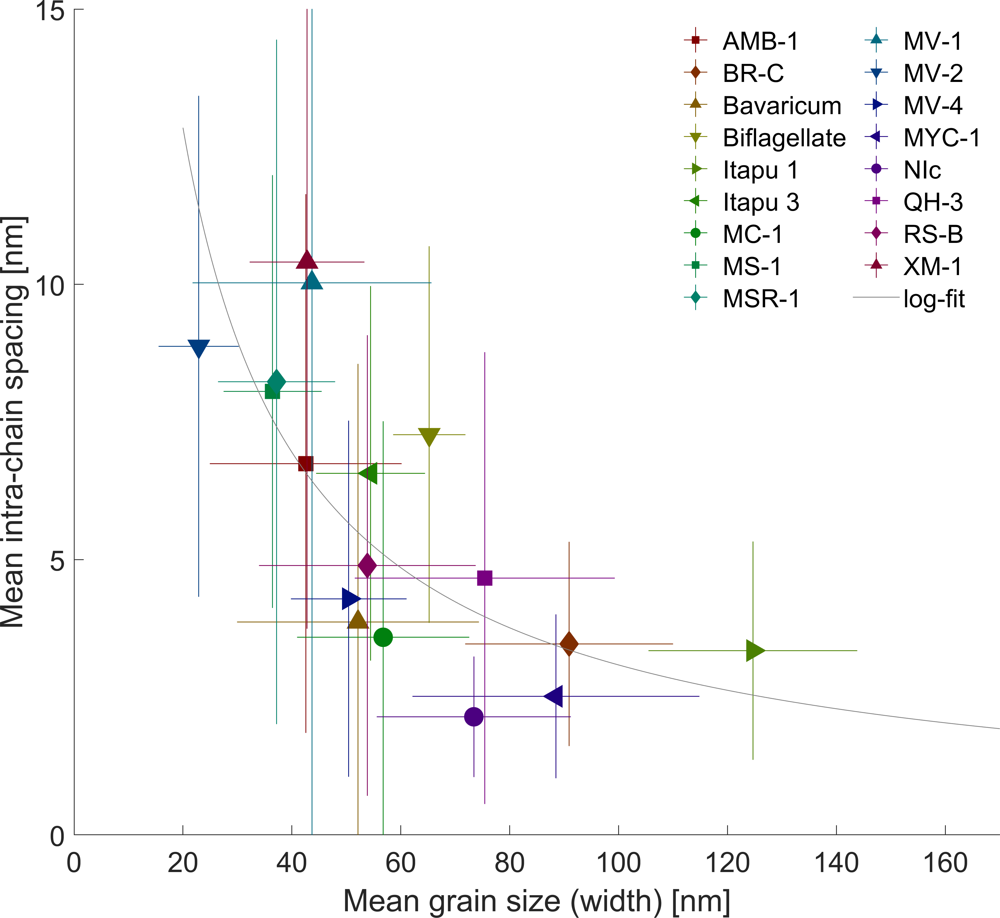
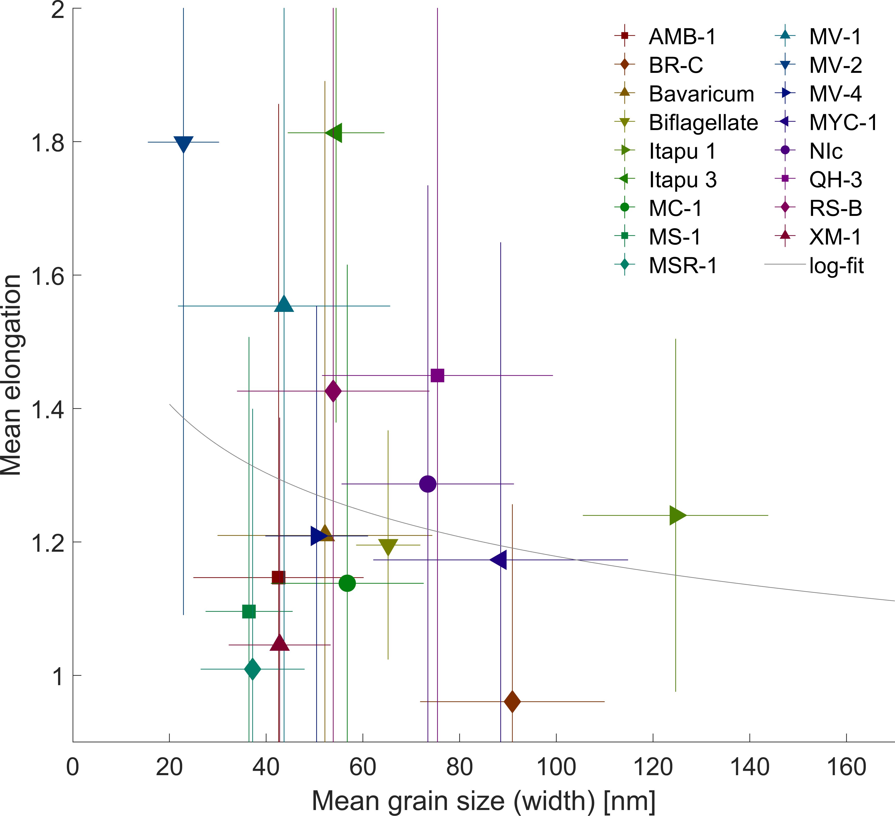
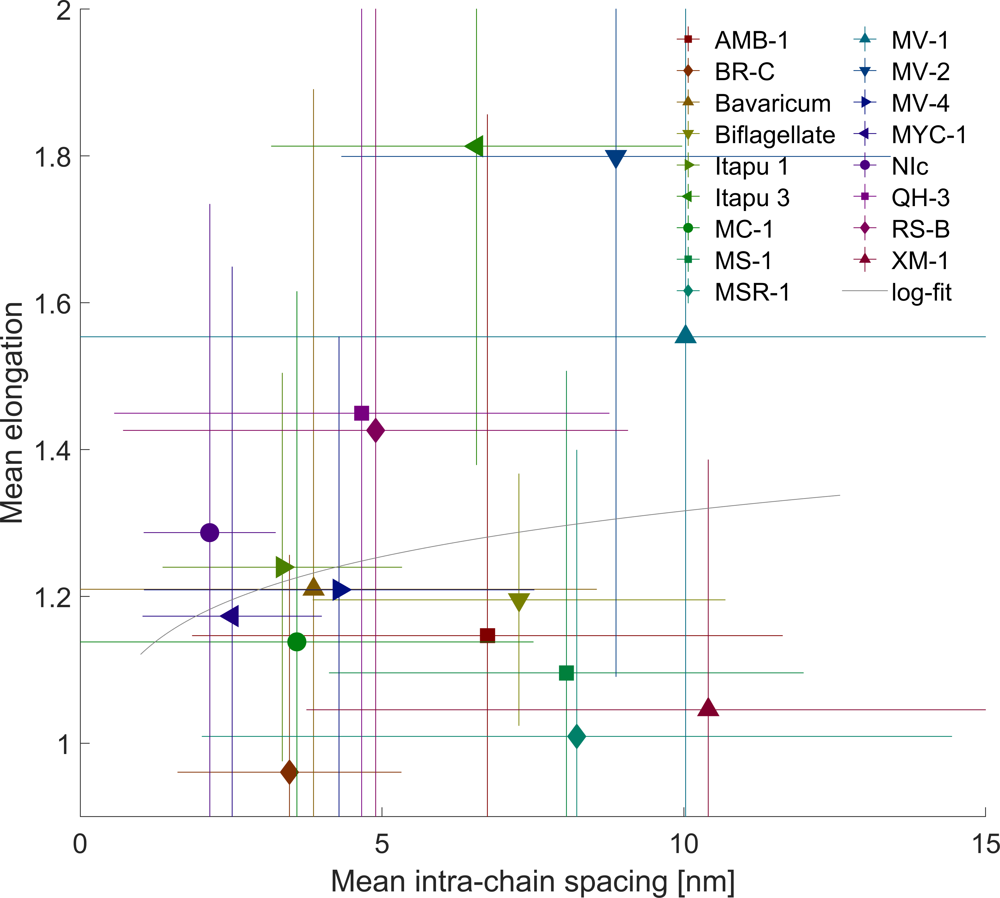

# Additional plots of TEM analysis

## Coercivity of remanence

## Coercivity

## Saturation remanence

## Correlation size vs. spacing

## Correlation size vs. elongation

## Correlation spacing vs. elongation
