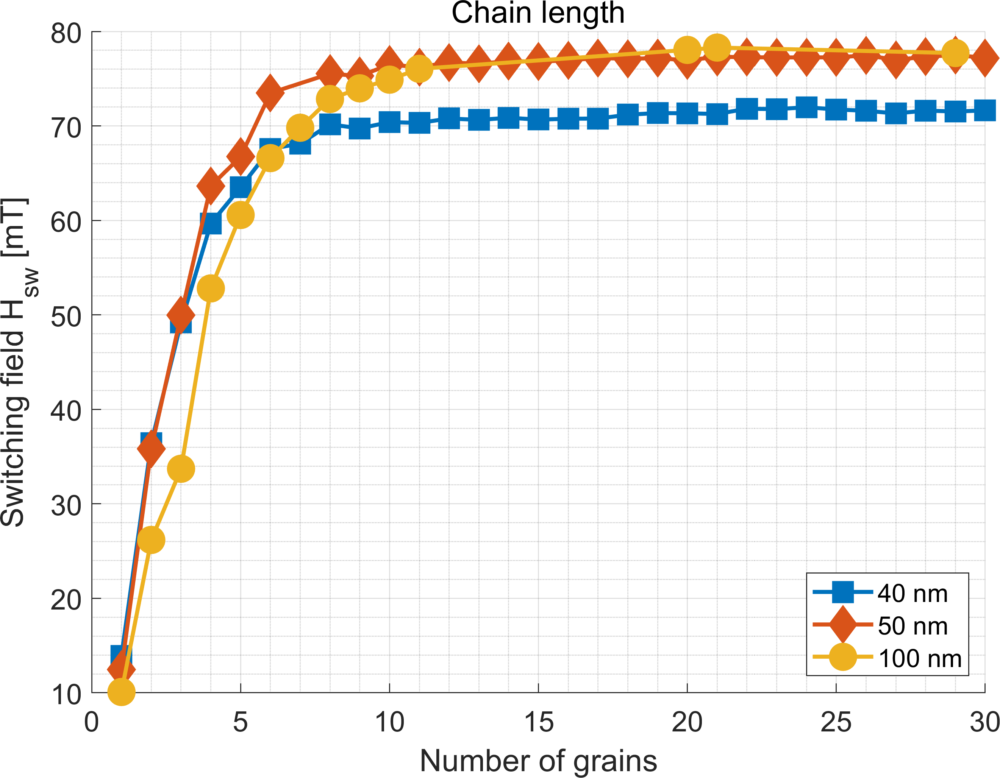
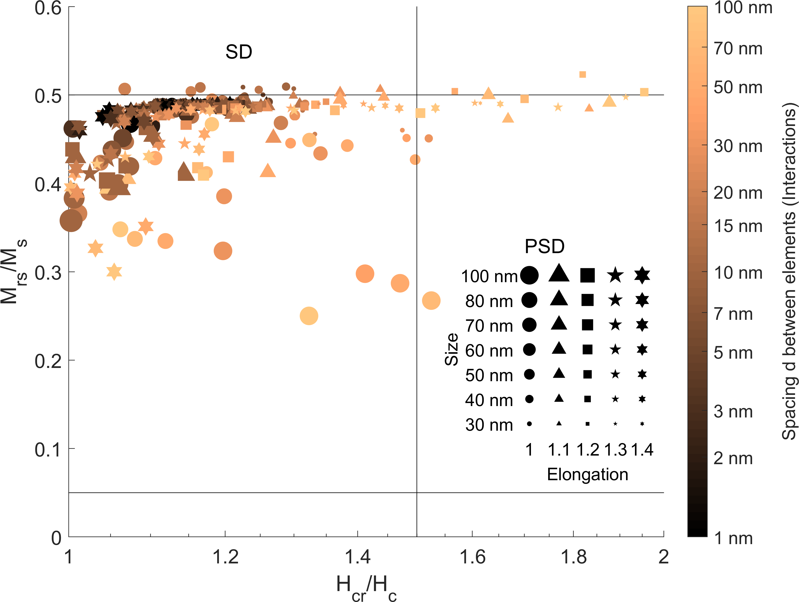
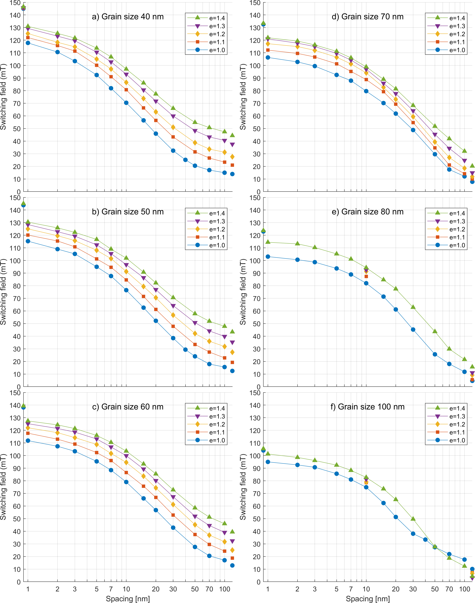
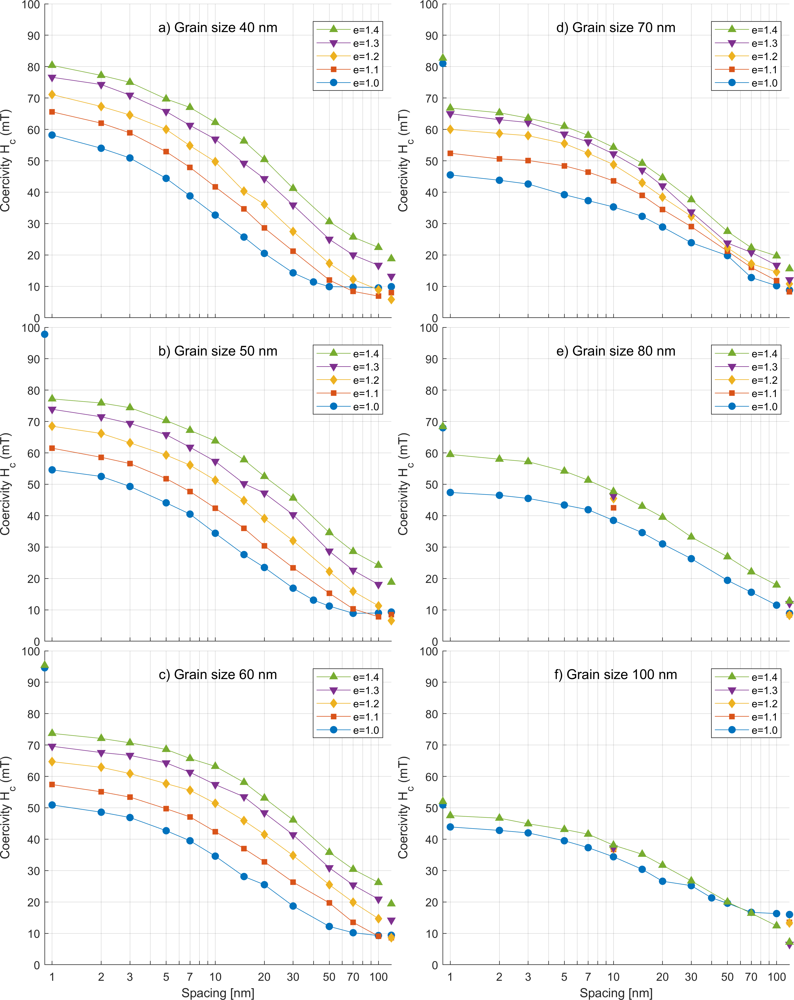
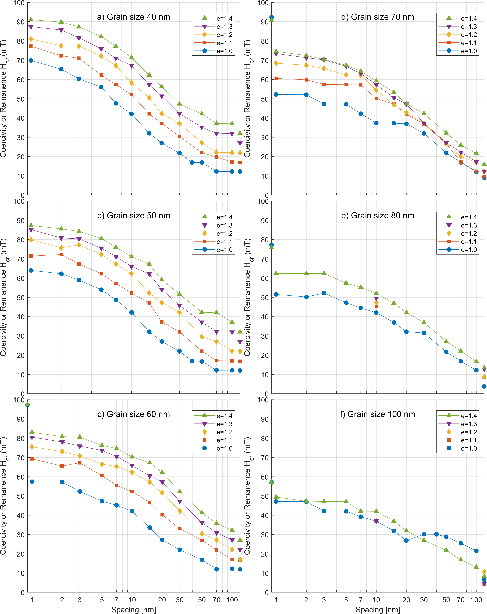
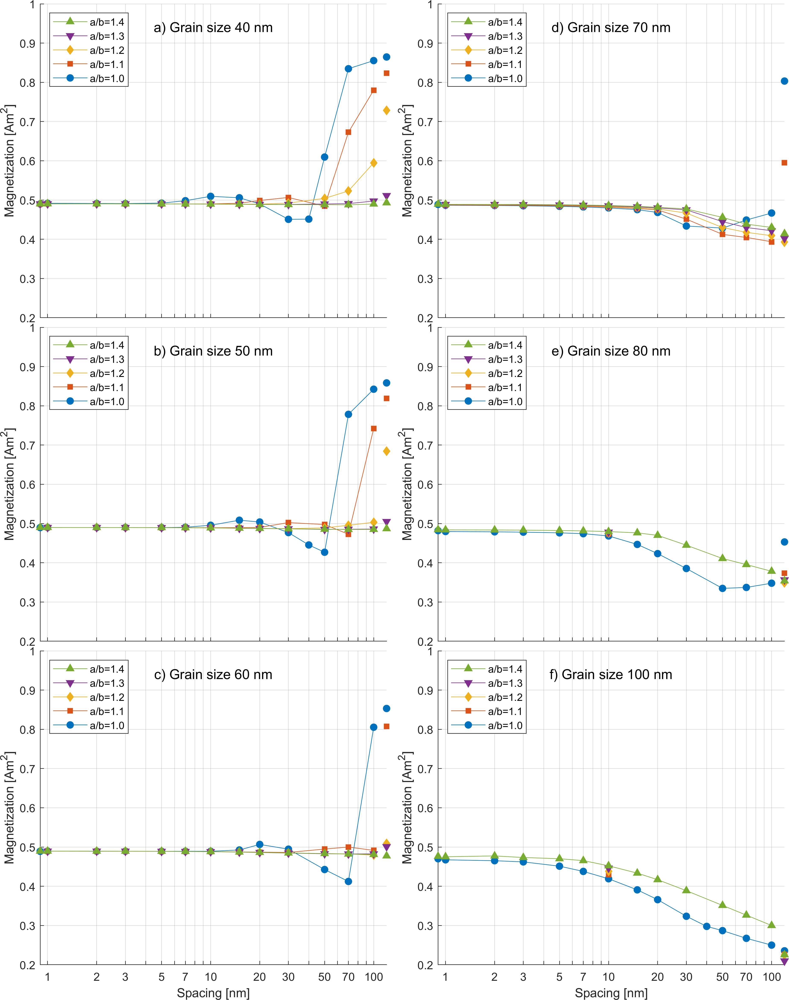
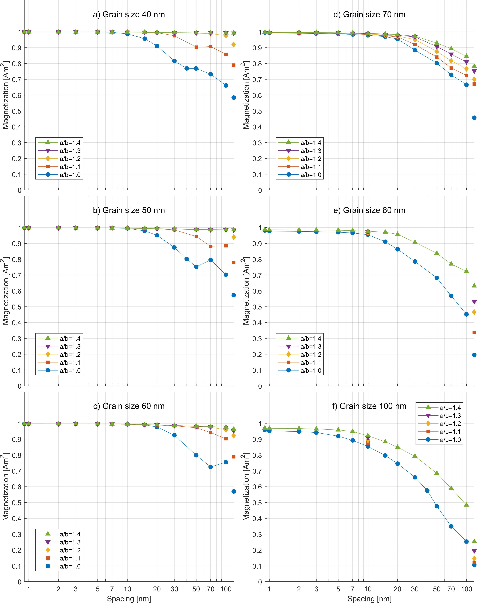
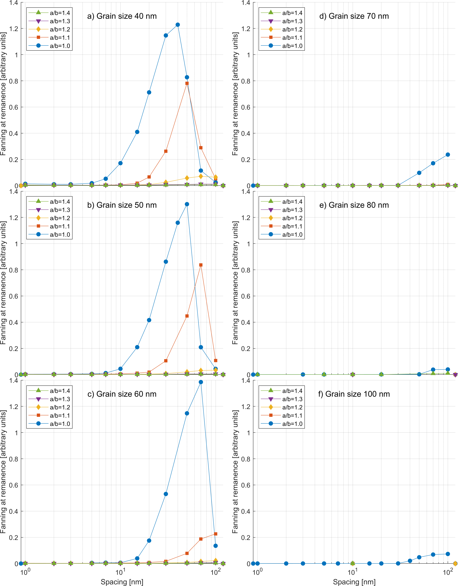
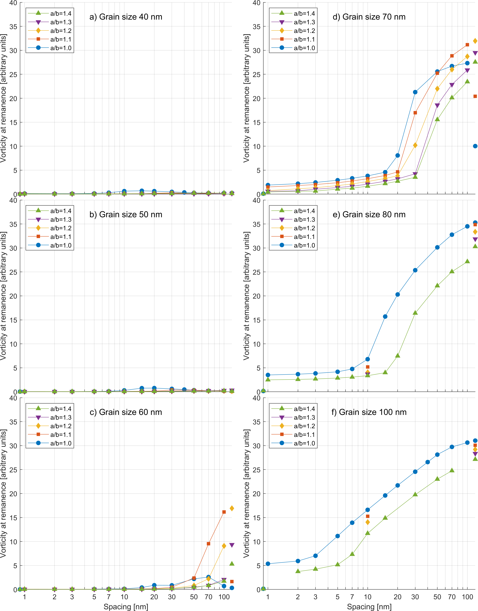
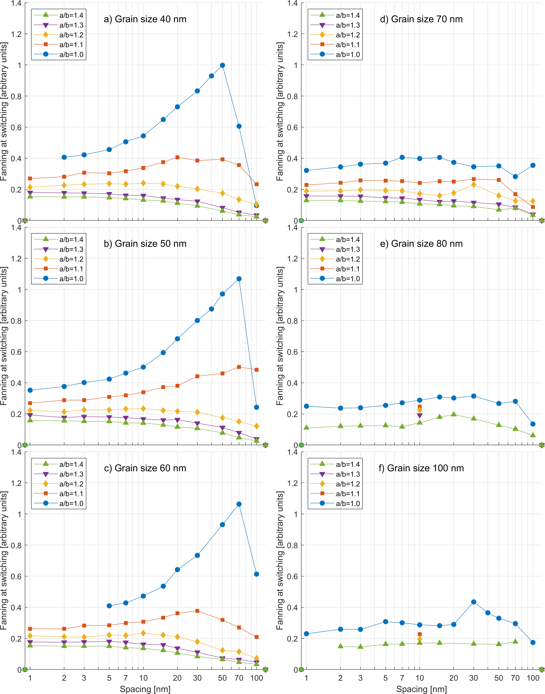

# Additional plots of micromagnetic model

## Coercivity vs. chain length

## Day plot

## Switching field vs. intra-chain spacing

## Coercivity vs. intra-chain spacing

## Coercivity of remanence vs. intra-chain spacing

## Remanent Magnetization vs. intra-chain spacing 

## Remanent Magnetization along chain axis vs. intra-chain spacing 

## Amount of fanning in remanent state vs. intra-chain spacing 

## Amount of vorticity in remanent state vs. intra-chain spacing 

## Amount of fanning during switching vs. intra-chain spacing 

## Amount of vorticity during switching vs. intra-chain spacing 
